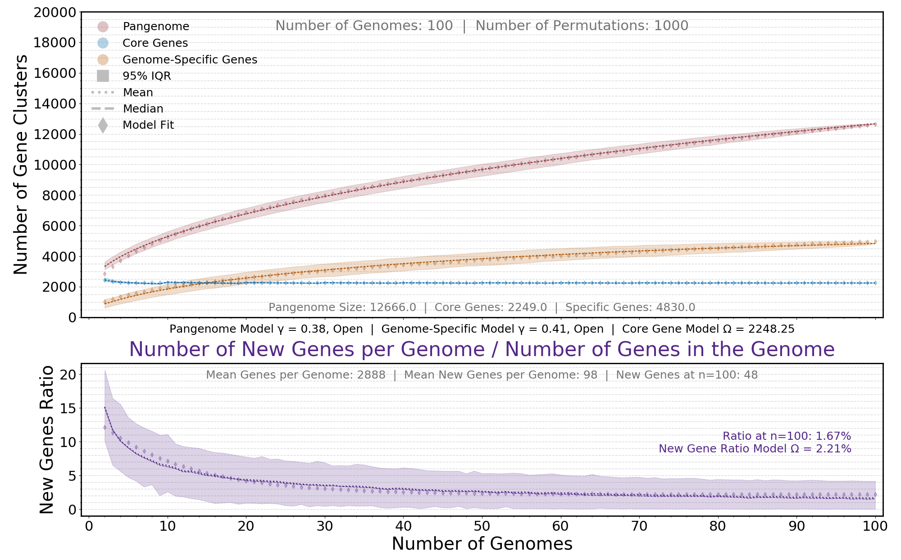

# This pipeline hasn't been polished

All of the components from this pipeline have been updated to use MMSeqs2 instead of CD-HIT and they are available in the (F100 Recombination workflow)[https://github.com/rotheconrad/F100_Prok_Recombination].
## The Basic Steps are here:

Before running CD-HIT:

Run Prodigal to get the gene predictions in nucleotide format. It's also a good idea to have prodigal write the amino acids as well. This way you will have both nucleotide and amino acid files for the same genes sharing the same names.

01: Before running Prodigal. Rename the contigs of the MAGs with a unique ID. For my pangenome scripts it is important that the fasta sequence IDs look like this: >UniqueID_RestoftheName

My pangenome scripts use this UniqueID part.

Concatenate the genes of the MAGs/Genomes to calculate the pangenome from.

02: Filter to remove too short genes. I think 300 nucleotides is a good minimum length. This step is because prodigal tends to return a bunch of short genes which can be partial genes too short to use or just inaccurate pseudo gene calls.

Run CD-HIT.
CD-HIT-EST parameters:
cd-hit-est -i ${g} -o ${o} -c 0.9 -n 8 -G 0 -g 1 -aS 0.7 -M 10000 -d 0 -T 10

${g} is the concatenated genes file
${o} is the name for the output file.

03: generate a binary matrix of gene presence or absence for each MAG/Genome. This is a matrix with the MAGs/Genomes as the column names and the gene clusters as the row names. The data is a 1 if the MAG has a gene in the cluster or a 0 if the MAG is missing from the cluster.

04: Compute Pangenome Analysis from the binary matrix.

To use the scripts have python 3.6+ installed with additional packages 
(Numpy, Pandas, LMfit, Matplotlib) and type:

```bash
python scriptname.py -h
```

# Pangenome Analysis Pipeline using Prodigal and CD-HIT

Scripts written for Python version 3.6+


## Step 00: Required tools :: Python 3.6+, Prodigal and CD-HIT.

### Python 3.6+ for running the Python scripts in this repo.

Information for installing and running Python can be found [here](https://www.python.org/). I recommend installing [mini conda](https://docs.conda.io/en/latest/miniconda.html) first and then creating an environment for Python 3.6+ and other tools for the project at hand.

*All Python scripts in this repo were written for Python 3.6+. If you get a syntax error the first time you run a script, please first check your Python version.*

Information for the scripts can be obtained by executing:

```bash
python scriptname.py -h
```

### Prodigal for protein coding gene prediction.
 
Information and installation instructions for Prodigal can be found [here](https://github.com/hyattpd/Prodigal). The publication is [here](https://www.ncbi.nlm.nih.gov/pmc/articles/PMC2848648/).

Prodigal can also be installed with a [conda environment](https://docs.conda.io/projects/conda/en/latest/user-guide/tasks/manage-environments.html):

```bash
conda create -n prodigal
conda activate prodigal
conda install -c bioconda prodigal
```

### CD-HIT to cluster predicted gene sequence.

Information and installation for CD-HIT can be found [here](https://github.com/weizhongli/cdhit/wiki/3.-User's-Guide). The publication can be found [here](https://academic.oup.com/bioinformatics/article/22/13/1658/194225).

CD-HIT can also be installed with a [conda environment](https://docs.conda.io/projects/conda/en/latest/user-guide/tasks/manage-environments.html):

```bash
conda create -n cdhit
conda activate cdhit
conda install -c bioconda cd-hit
```

## Step 01: Predict protein coding genes with Prodigal.

## Step 02: CD-Hit

## Step 03: Generate binary presence/absence matrix

## Step 04: Build pangenome rarefaction models and curves

Currently, if you've clustered sequences with CD-HIT from multiple genomes, the clstr to binary matrix script will turn the CD-HIT cluster file into a binary matrix with genes as the rows and genomes as the columns. This script needs to be modified at line 68 so the genomeID variable retrieves the unique genomeID from your fasta sequence names.

Once you have a binary matrix, the calculate model plot script will build some nice output like so:



## Step 05: Build clustered heatmap based on shared gene content.
